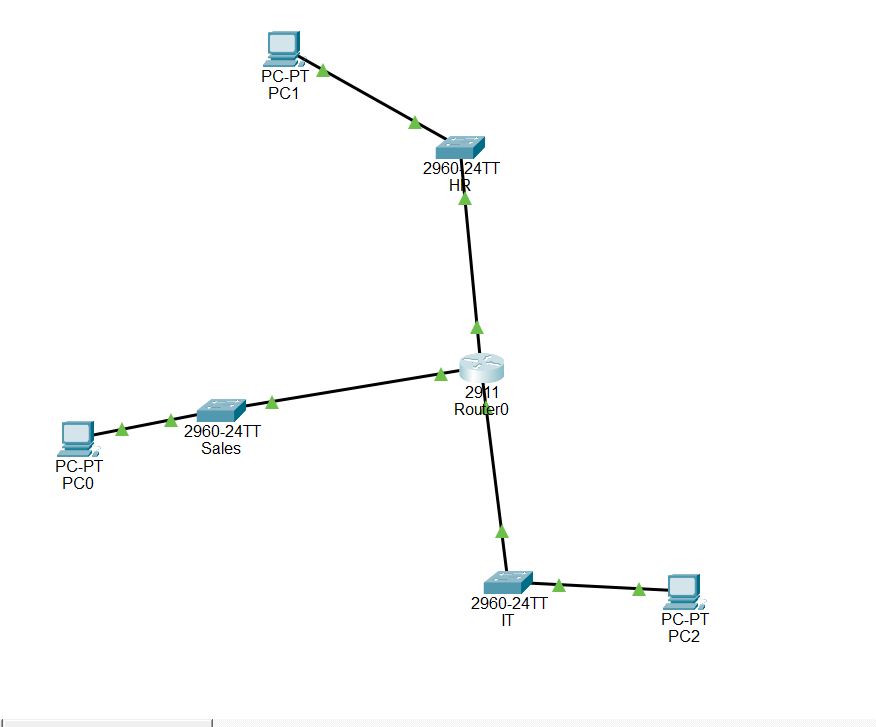

# Lab: Subnetting a /24 into Three Departments

**Date:** 2026-09-28
**Tool:** Cisco Packet Tracer

## Objective
Split a single 192.168.10.0/24 network into three department subnets (Sales, HR, IT) and route between them using one router with three interfaces.

## Topology



PC0 (Sales) -- Sales Switch -- Router0 -- HR Switch -- PC1 (HR)
                                   |
                              IT Switch -- PC2 (IT)

## Subnetting plan

Original network: `192.168.10.0/24`, split into three `/26` blocks (64 addresses each, 62 usable hosts).

| Department | Subnet | Gateway | Router Interface |
|---|---|---|---|
| Sales | 192.168.10.0/26 | 192.168.10.1 | Gi0/0 |
| HR | 192.168.10.64/26 | 192.168.10.65 | Gi0/1 |
| IT | 192.168.10.128/26 | 192.168.10.129 | Gi0/2 |

A /26 was chosen because 62 usable hosts comfortably covers each department without wasting address space the way a full /24 each would.

## Configuration
Each router interface was assigned the department's gateway address and brought up with `no shutdown`. No static or default routes were needed — with a directly connected interface in each subnet, Router0 automatically installs a connected route for each one.

## Verification

Confirmed all three subnets are directly connected with `show ip route`:

```
192.168.10.0/24 is variably subnetted, 6 subnets, 2 masks
C 192.168.10.0/26 is directly connected, GigabitEthernet0/0
L 192.168.10.1/32 is directly connected, GigabitEthernet0/0
C 192.168.10.64/26 is directly connected, GigabitEthernet0/1
L 192.168.10.65/32 is directly connected, GigabitEthernet0/1
C 192.168.10.128/26 is directly connected, GigabitEthernet0/2
L 192.168.10.129/32 is directly connected, GigabitEthernet0/2
```

Tested full connectivity with `ping` between PCs on all three departments (e.g. Sales PC to IT PC) — successful in every direction.

## What I learned
- Splitting a /24 into /26 blocks is a clean way to separate departments while keeping enough headroom (62 hosts) per subnet.
- A router shows two route types per connected subnet: `C` (the whole subnet, connected) and `L` (the router's own interface address as a /32) — both appear automatically, no static routing required.
- With one router interface per subnet, routing between departments works immediately once each interface is up and addressed — there's no separate "enable routing between subnets" step.
