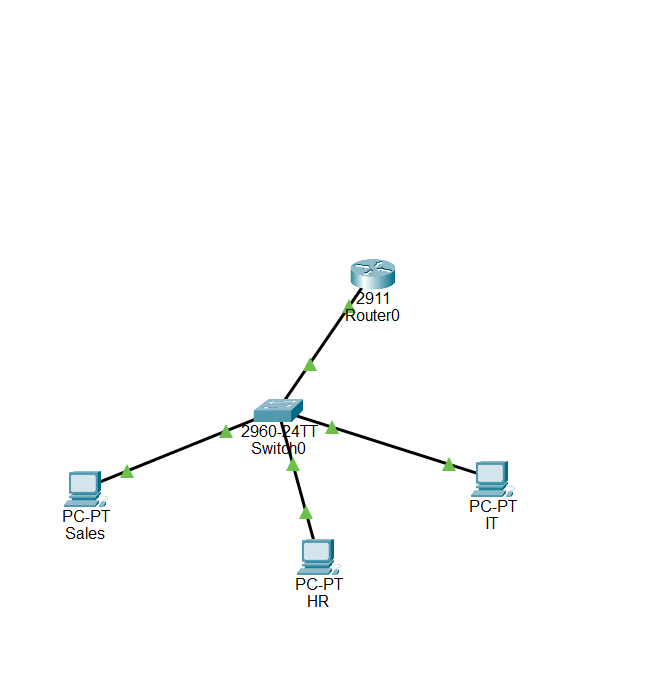

# Lab: VLANs, Trunking, and Router-on-a-Stick

**Date:** 2026-10-02
**Tool:** Cisco Packet Tracer

## Objective
Rebuild the three-department network (Sales, HR, IT) from the earlier subnetting lab — but instead of three physical switches, use VLANs on a single switch, with a trunk link carrying all VLAN traffic to the router, and router subinterfaces handling inter-VLAN routing.

## Topology

Router0 -- Switch0 -- Sales PC
                    -- HR PC
                    -- IT PC

## VLAN & trunk configuration

| VLAN | Department | Switch Port (access) |
|---|---|---|
| 10 | Sales | Fa0/1 |
| 20 | HR | Fa0/2 |
| 30 | IT | Fa0/3 |

The switch-to-router link (Gi0/1) was configured as an **802.1Q trunk**, so it carries all three VLANs over a single cable instead of needing one cable per department.

## Router-on-a-stick (subinterfaces)

Since the router only has one physical link to the switch, it needs a separate **subinterface** per VLAN to route between them:

| Subinterface | VLAN | Encapsulation | IP Address |
|---|---|---|---|
| Gi0/0.10 | 10 | dot1Q 10 | 192.168.10.1 /26 |
| Gi0/0.20 | 20 | dot1Q 20 | 192.168.10.65 /26 |
| Gi0/0.30 | 30 | dot1Q 30 | 192.168.10.129 /26 |

## End devices

| Device | IP Address | Gateway |
|---|---|---|
| Sales PC | 192.168.10.2 /26 | 192.168.10.1 |
| HR PC | 192.168.10.66 /26 | 192.168.10.65 |
| IT PC | 192.168.10.133 /26 | 192.168.10.129 |

## Verification

- Each PC successfully pinged its own gateway (4/4, 0% loss).
- Cross-VLAN connectivity confirmed: Sales PC → IT PC and HR PC → IT PC both succeeded (4/4, 0% loss), with **TTL=127** — one less than a PC's default TTL of 128, since the packet crossed one router hop. A direct PC-to-gateway ping showed TTL=255 (the router's own default), which is a useful way to tell whether a reply came from a router or an end device.

## What I learned
- VLANs let you logically separate departments on a single switch instead of needing a dedicated switch per department — same isolation, less hardware.
- A trunk port carries multiple VLANs over one physical link by tagging frames with their VLAN ID (802.1Q).
- A router with only one physical interface can still route between VLANs by creating subinterfaces — one per VLAN, each with its own encapsulation and IP — a setup known as router-on-a-stick.
- TTL can reveal whether a ping reply came from an end device or a router: TTL=127 (128 − 1 hop) vs TTL=255 signals one router hop was crossed.
- This rebuild reached the same end result as the original three-switch lab, confirming VLANs + trunking + router-on-a-stick is a functionally equivalent, more efficient design.
